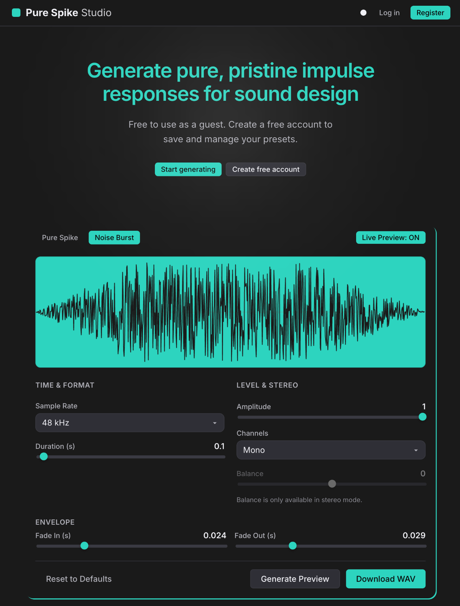
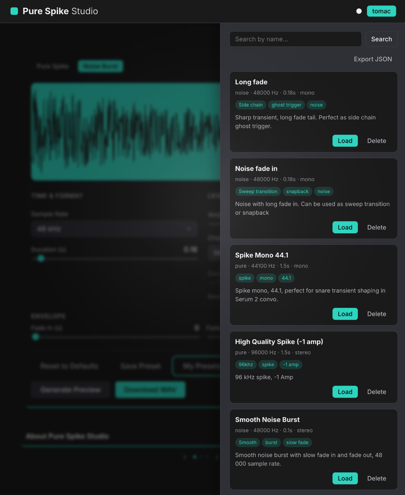

# Pure Spike Studio

**Generate pure, pristine impulse responses for sound design.**

Live demo: **[https://pure-spike-m5cg.vercel.app](https://pure-spike-m5cg.vercel.app)**

A fullstack tool for music producers and sound designers. Create clean, mathematical impulse responses for convolution reverbs and transient shaping — then export them as high-quality 32-bit float WAV files for use in Ableton Live, Xfer Serum 2, and other DAWs/plugins.

Works fully as a **guest**. Create a free account if you want to save and manage presets.





## Features

### Generator (no account required)

- **Two impulse types:** Pure Spike and Noise Burst
- Sample rate, duration, amplitude, mono/stereo + balance
- Fade in / fade out envelope
- Real-time waveform preview (Canvas)
- Live Preview mode
- 32-bit float WAV export (client-side Web Audio / OfflineAudioContext)

### Account (optional)

- Register / login (email + password)
- Save, search, load, and delete presets
- Export all presets as JSON
- Session restore via httpOnly refresh cookies
- Account deletion (cascades presets)

## Tech stack

| Layer    | Stack                                                                              |
| -------- | ---------------------------------------------------------------------------------- |
| Frontend | React 19, TypeScript, Vite, CSS Modules, React Router                              |
| Backend  | Node.js, Express, TypeScript, Zod                                                  |
| Database | MongoDB Atlas + Mongoose                                                           |
| Auth     | JWT access tokens + httpOnly refresh cookies, bcrypt                               |
| Deploy   | Frontend on [Vercel](https://vercel.com) · Backend on [Render](https://render.com) |

All impulse generation runs **in the browser**. The backend only handles auth and preset storage.

## Lighthouse (production)

| Performance | Accessibility | Best Practices | SEO |
| ----------- | ------------- | -------------- | --- |
| 100         | 96            | 96             | 100 |

## Local development

### Prerequisites

- Node.js 20+
- MongoDB Atlas account (or local MongoDB)

### 1. Clone

```bash
git clone https://github.com/TomacBarin/pure-spike.git
cd pure-spike
```

### 2. Backend

```bash
cd backend
cp .env.example .env
# Edit .env: MONGODB_URI, JWT secrets, FRONTEND_ORIGIN=http://localhost:5173
npm install
npm run dev
```

API runs at `http://localhost:3001` (health: `/api/v1/health`).

### 3. Frontend

```bash
# from repo root
npm install
npm run dev
```

App runs at `http://localhost:5173`. Vite proxies `/api` to the backend in development.

### Production env notes

| Variable                                   | Where  | Purpose                                                          |
| ------------------------------------------ | ------ | ---------------------------------------------------------------- |
| `VITE_API_URL`                             | Vercel | Absolute API base, e.g. `https://pure-spike.onrender.com/api/v1` |
| `FRONTEND_ORIGIN`                          | Render | Vercel URL for CORS + cookies                                    |
| `MONGODB_URI`                              | Render | Atlas connection string                                          |
| `JWT_ACCESS_SECRET` / `JWT_REFRESH_SECRET` | Render | Long random secrets                                              |

## Project structure

```text
pure-spike/
├── src/                  # Frontend (Vite + React)
│   ├── components/       # Shared UI
│   ├── features/         # generator, auth, presets
│   ├── providers/        # Auth, Theme
│   └── api/              # Typed API client
├── backend/              # Express API
│   └── src/
├── docs/                 # PRD, architecture, phase docs, screenshots
└── package.json
```

## Documentation

More detail in [`/docs`](./docs/):

- [Project brief](./docs/project-brief.md)
- [PRD](./docs/prd.md)
- [Architecture](./docs/architecture.md)
- [Phase docs](./docs/phases/)
- [Current status](./docs/current-status.md)

## License

MIT – see [LICENSE](./LICENSE).

---

Built as a portfolio fullstack project (React, TypeScript, Node.js).
